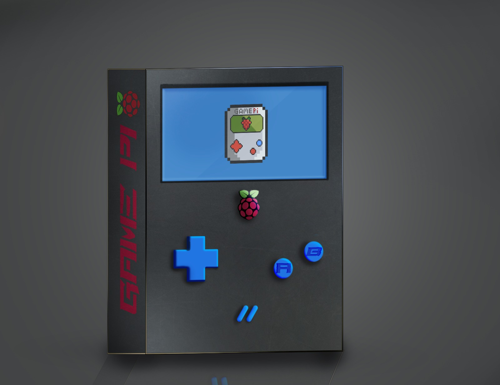

# GamePI
Game Boy Emulator for Raspberry Pi 4
Todo: Description

# ⬇️ Getting Started
How to install on your raspberry PI 
### Clone the repository
`git clone https://github.com/nadav26740/GamePI.git`

### For automaticly installation -  Run the installation shell
`cd ./GamePI` 
`./install.sh` 

### To manualy install
### Install all the requirements
[Requirements](#Requirements)

### Compile the system using build.sh
`cd ./GamePI/src` 
`./build.sh --release` 

### Make Required folders
`cd` 
`mkdir .GAMEPI` 
`cd .GAMEPI` 
`mkdir EMULATOR_GAMES` Here all the games will be saved

# Requirements 
SFML 2.6.2
C++17

# 📝 License
[Apache License](./License)

# Concept Image

